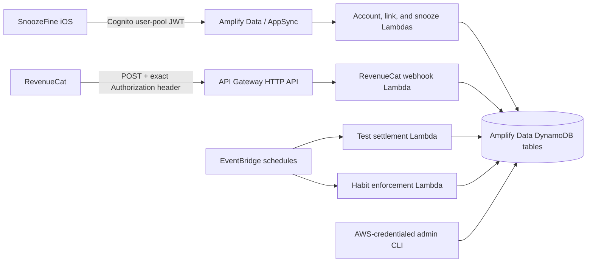

# Architecture

## Deployed components



`amplify/backend.ts` composes Cognito, AppSync, Amplify Functions, the HTTP API, the schedule, table
permissions, function table-name configuration, and generated public client outputs. Physical
table mappings used by the admin CLI remain backend-only and are never copied into iOS.

## Trust boundaries and authorization

| Surface                    | Caller                                     | Authorization                                         | Data authority                                                                  |
| -------------------------- | ------------------------------------------ | ----------------------------------------------------- | ------------------------------------------------------------------------------- |
| `linkRevenueCatCustomer`   | signed-in app user                         | Cognito/AppSync                                       | stable RevenueCat ID must equal token `sub`; alias IDs are conditionally unique |
| `recordSnooze`             | signed-in app user                         | Cognito/AppSync                                       | user ID and 25-point amount are server-derived                                  |
| `getMyPointAccount`        | signed-in app user                         | Cognito/AppSync                                       | function queries only token `sub` + deployment environment                      |
| `listMyPointTransactions`  | signed-in app user                         | Cognito/AppSync                                       | partition is token `sub:environment`                                            |
| habit operations           | signed-in app user                         | Cognito/AppSync                                       | identity and penalty are server-derived; progress event IDs are idempotent      |
| sync/statistics operations | signed-in app user                         | Cognito/AppSync                                       | account-scoped alarm/wake records; AlarmKit remains device-local                |
| community vote             | eligible signed-in app user                | Cognito/AppSync                                       | one transactionally enforced vote per user-local day                            |
| `recordMyEngagement`       | signed-in app user                         | Cognito/AppSync                                       | allow-listed event names; token `sub`; no arbitrary properties                  |
| account deletion request   | signed-in app user                         | Cognito/AppSync                                       | queues an auditable owner cleanup request before Cognito self-deletion          |
| generated model reads      | `ADMINS` only (plus owner read of profile) | Cognito group rules                                   | no generated client model writes exist                                          |
| RevenueCat webhook         | RevenueCat server                          | exact header, constant-time SHA-256 digest comparison | lifecycle fields come from validated webhook                                    |
| monthly settlement         | EventBridge or `ADMINS` custom mutation    | schedule / Cognito group                              | always calculation-only TEST mode                                               |
| admin CLI                  | operator                                   | AWS SDK credential chain/IAM                          | direct, auditable transactional operations                                      |

No client operation accepts a user ID, point amount, resulting balance, entitlement status, or
subscription status.

## Identity migration

Cognito `sub` is canonical. The function requires the submitted stable RevenueCat ID to equal the
authenticated token's `sub`. `RevenueCatCustomerLink` uses every RevenueCat identifier as a primary
record ID and maps it to one canonical user. Linking stable and old anonymous IDs occurs in one
DynamoDB transaction with `attribute_not_exists(id) OR userId = :sameUser`; a RevenueCat ID cannot
be reassigned to another user.

Webhook resolution checks `app_user_id`, `original_app_user_id`, and `aliases`. Transfer events
resolve only destination identifiers (`transferred_to` plus destination identity fields);
`transferred_from` remains audit metadata and cannot accidentally assign the event to the former
owner. Conflicting matches fail visibly. No match creates an `UNRESOLVED` webhook audit record
rather than discarding the event.

The iOS migration order is:

1. authenticate and get the Cognito `sub`;
2. capture the old RevenueCat anonymous ID;
3. link both stable `sub` and anonymous ID in the backend;
4. call `Purchases.shared.logIn(cognitoSub)`.

## Webhook lifecycle and allocation

The runtime Zod schema bounds identity arrays/strings and validates timestamps/environment. The
handler rejects non-POST methods, wrong paths, invalid authorization, invalid JSON/schema, and
payloads over 256 KiB. It logs event ID/type/status, never the full body or secret.

Supported lifecycle events:

- `INITIAL_PURCHASE`, `RENEWAL`: set active state; allocate only for the configured entitlement and
  monthly product with valid period bounds.
- `PRODUCT_CHANGE`: update lifecycle state but never allocate (the accompanying genuine purchase/
  renewal event owns allocation).
- `CANCELLATION`, `SUBSCRIPTION_PAUSED`: remain eligible until the period expiration timestamp.
- `UNCANCELLATION`: restore active state without allocating.
- `BILLING_ISSUE`: grace-period status when RevenueCat supplies a future grace expiry, otherwise a
  non-expired billing-issue state.
- `EXPIRATION`: mark expired and allocate nothing.
- `TRANSFER`: preserve audit/resolution without minting points.
- unknown events: persist as `IGNORED` no-ops.

The webhook event, optional subscription update, point period, +2,000 ledger transaction, and
account projection are committed in one DynamoDB transaction. The RevenueCat event ID is the
webhook primary key. Allocation uses:

```text
subscription-allocation:{userId}:{entitlementId}:{periodStartUTC}
```

The period and transaction IDs are deterministic SHA-256 values. Conditional writes and account
version checks handle both duplicate webhooks and concurrent snoozes. A new subscription period
sets the usable account balance to that period's 2,000 points; unused prior-period points remain in
their immutable period/ledger history but are no longer spendable.

Out-of-order lifecycle events cannot overwrite a newer subscription state: the state write is
conditioned on RevenueCat's `event_timestamp_ms`. An older event is still persisted for audit.

## Snooze transaction

`recordSnooze` validates a UUID event ID and UTC ISO timestamp, permits at most five minutes into
the future, and rejects events older than seven days. The function loads only the authenticated
user's account/subscription in the configured environment. Active, grace, billing-issue, and
cancelled-pending-expiry states are eligible only before `currentPeriodEnd`.

One DynamoDB transaction:

1. conditionally inserts `SnoozeEvent`;
2. conditionally inserts the immutable ledger transaction;
3. updates `PointAccount` when version, active period, and old balance match;
4. updates `PointPeriod` when owner and old remaining balance match.

The deduction is `min(25, currentBalance)`, so balance cannot be negative. On contention the entire
read/transaction retries. The idempotency key is `snooze:{cognitoSub}:{snoozeEventId}`. Duplicate
submissions read and return the original server result.

Device-originated evidence cannot be fully tamper-proof. Timestamp bounds, Cognito, idempotency,
fixed server pricing, and subscription eligibility reduce abuse; App Attest/DeviceCheck and Apple
transaction verification remain later hardening items.

## Ledger and projection

`PointTransaction` is append-only through application APIs. Each balance change has a signed
integer transaction:

- `MONTHLY_ALLOCATION` / `REVENUECAT_WEBHOOK`
- `SNOOZE_DEDUCTION` / `IOS_APP`
- `ADMIN_ADJUSTMENT` / `ADMIN`

Normal clients receive no create/update/delete authorization for ledger or projection models.
`PointAccount` is a concurrency-controlled projection; `PointPeriod.currentRemaining` supports
period settlement. `OPERATIONS.md` contains reconciliation steps.

## Phase 2 habit accountability

Habit definitions, occurrences, and progress events are scoped to the authenticated Cognito user
and environment. The client may choose a goal, schedule, deadline, and progress amount, but it
cannot choose the server penalty or submit a user ID. Progress event UUIDs are account-bound and
idempotent. A 15-minute EventBridge schedule pages through every active sandbox habit, evaluates
timezone-aware due dates, and transactionally records at most one `HABIT_DEDUCTION` per missed
occurrence. Ineligible periods are recorded as `SKIPPED_INELIGIBLE` and never charged.

## Retention analytics boundary

The authenticated engagement stream exists only to measure core product retention. It accepts a
random event UUID, random app-session UUID, one allow-listed event name, occurrence timestamp, and
optional app version. The AppSync function injects the Cognito `sub` and deployment environment,
rejects timestamps outside the bounded window, and conditionally inserts the event once. There is
no advertising SDK, cross-app identifier, IP/device fingerprint field, free-form property bag, or
client-controlled user identity. Analytics failures never block authentication, alarms, points,
or navigation.

## Settlement rule (calculation version `v1`)

The scheduled function runs at 02:00 UTC on the first day of each month and calculates the previous
UTC calendar month. Allocation periods remain subscription-period based.

For each canonical user in the selected environment, `v1`:

1. considers resolved point periods containing the last millisecond of the calendar month;
2. requires subscription state eligible and unexpired at that cutoff;
3. picks the latest-starting qualifying period if data overlaps;
4. counts the user once;
5. clamps remaining to `0...initialAllocation`;
6. multiplies integer remaining points by 1,000 micro-USD.

This first version uses the period's current/latest remaining projection for the cutoff. It does
not reconstruct historical intraperiod balances from transactions posted after a past cutoff.
Operational reruns should therefore happen promptly; exact backdated “as-of” reconstruction is a
documented production-hardening item.

Settlement ID is `{YYYY-MM}:{environment}:v1`, so reruns are idempotent. Records and output are
always labelled `TEST`, “expected donation,” and “not yet paid.” There is no payment/charity client
or transfer code.
